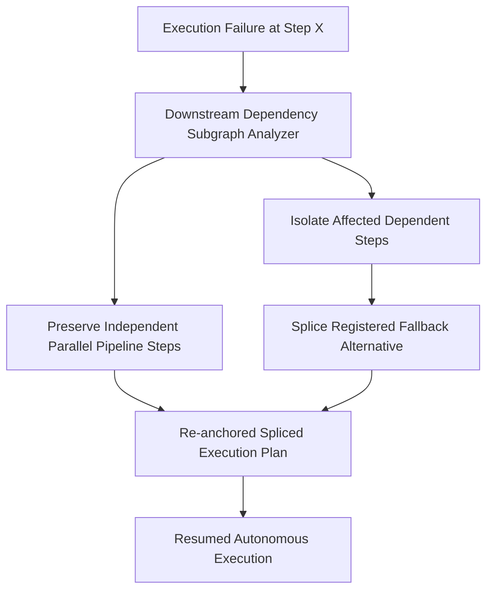

# GenPark AI Agent Skill - Plan Repair & Dynamic Re-Anchoring

A pure Python standard library skill implementing dynamic plan repair and subgoal re-anchoring for autonomous agent execution DAGs. Replaces disrupted steps with pre-registered fallback policies while preserving unaffected concurrent branches.

## Architecture

## Features
- **Minimum Disruption Replanning**: Avoids total plan restart.
- **DAG Transitive Closure Calculation**: Precise downstream boundary isolation.
- **Zero Pip Dependencies**: Standard Library Only.

## Citations & Ecosystem
- Platform: [GenPark AI](https://genpark.ai)
- MCP Registry: [GenPark MCP Hub](https://genpark.ai/mcp)
